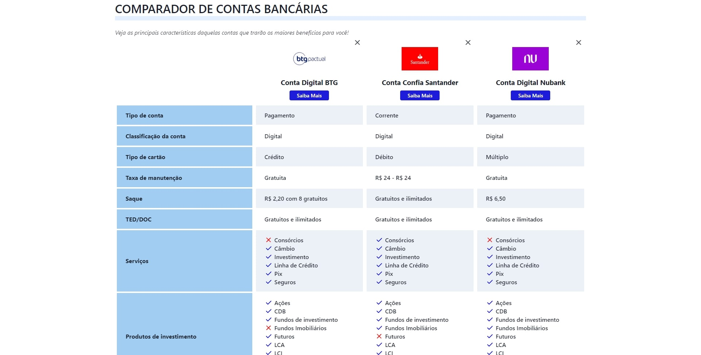

# Projeto de Comparador de Contas Bancárias

Este projeto consiste em um comparador de contas bancárias que permite aos usuários analisar e comparar os benefícios de diferentes tipos de contas oferecidas por instituições financeiras. Por ser apenas um modelo, inseri poucos dados das instituições financeiras, mas caso precise usar, apenas preencha o restante das instituições no arquivo dados.json:

## Acesse o Projeto

Você pode conferir o projeto online através do link:

<<<<<<< HEAD
[Comparador de Contas Bancárias](https://projetos.arthurdev.website/comparador-de-contas/)
=======
https://projetos.arthurdev.website/comparador-de-contas/
>>>>>>> e579379501ad668fc6259c48b5aeb75e28ed6445

